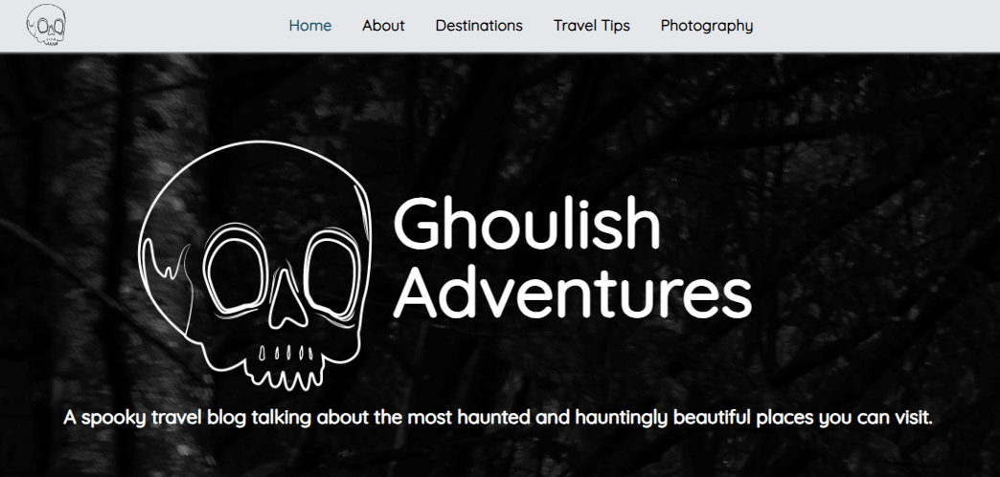

# Ghoulish Adventures

  This is a website I made to practice correct accessibility use for web development.

  The website is a parody on travel blogs, I chose to give mine a spooky theme just in time for halloween!

Here is the link to the website: https://ghoulish-adventures.netlify.app/

It's hosted on Netlify.

### Some resources I've used
- https://tailwindcss.com/
- https://tailwindcolor.com/
- https://unsplash.com/
- https://www.dummies.com/article/body-mind-spirit/religion-spirituality/the-paranormal/ghost-hunting-for-dummies-cheat-sheet-266009/
- https://fonts.google.com/
- https://icons8.com/

